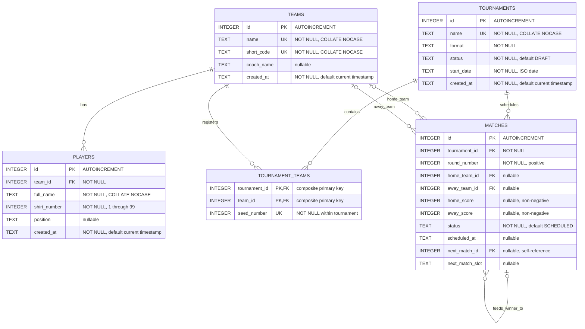

# Database ER Diagram

This Mermaid diagram mirrors `src/main/resources/db/schema.sql`. SQLite uses `INTEGER` and `TEXT`; nullable columns are marked in their descriptions.

## Relationship and constraint notes

- `players.team_id` references `teams.id` with `ON DELETE RESTRICT`.
- `tournament_teams.tournament_id` references `tournaments.id` with `ON DELETE CASCADE`.
- `tournament_teams.team_id` references `teams.id` with `ON DELETE RESTRICT`.
- `matches.tournament_id` references `tournaments.id` with `ON DELETE CASCADE`.
- `matches.home_team_id` and `matches.away_team_id` reference `teams.id` with `ON DELETE RESTRICT`.
- `matches.next_match_id` references `matches.id` with `ON DELETE SET NULL`. At most two feeder matches are created for one downstream knockout match by the scheduling algorithm.
- `(team_id, shirt_number)` is unique in `players`.
- `(tournament_id, seed_number)` is unique in `tournament_teams`; `(tournament_id, team_id)` is its composite primary key.
- A match cannot contain the same known team in both slots.
- `next_match_id` and `next_match_slot` must both be null or both be present.
- Pending matches have an unknown participant and no scores. Scheduled matches have both participants and no scores. Completed matches have both participants and both scores.

The schema also indexes player-team lookup, team-registration lookup, and tournament/round match lookup.
