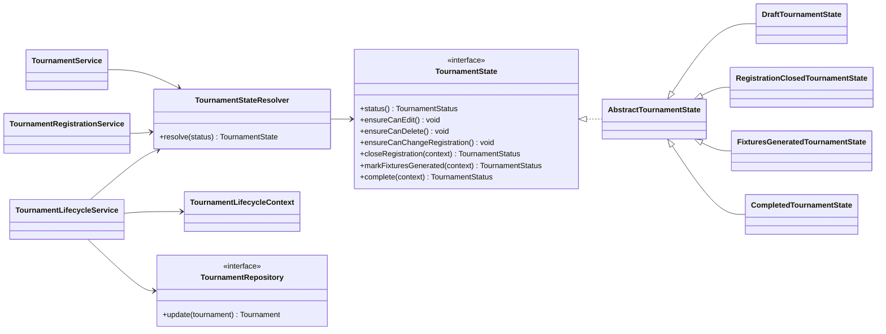

# Design Patterns

## State: tournament lifecycle

### Problem

Tournament operations depend on the current lifecycle stage. A Draft tournament can be edited and accept registrations, a Registration Closed tournament can generate fixtures, a Fixtures Generated tournament can finish only after every fixture is complete, and a Completed tournament must reject further lifecycle changes. Keeping these checks as repeated status conditions in services would make the rules easy to duplicate or contradict.

### Decision

`TournamentState` defines the lifecycle operations. `DraftTournamentState`, `RegistrationClosedTournamentState`, `FixturesGeneratedTournamentState`, and `CompletedTournamentState` implement the behavior for one status each. `TournamentStateResolver` maps the persisted `TournamentStatus` to the corresponding behavior.

`TournamentService` and `TournamentRegistrationService` ask the current state whether editing, deletion, or registration changes are permitted. `TournamentLifecycleService` gathers registered-team and fixture progress, asks the state for a validated next status, and calls `TournamentRepository.update` only after validation succeeds.

### Alternative considered

A direct alternative was to place `if` or `switch` checks for `TournamentStatus` in each application service. That would use fewer classes initially, but the same status rules would be repeated across editing, registration, scheduling, and completion workflows.

### Consequence

The lifecycle has several small classes, but each class has one clear reason to change. Application services continue to coordinate persistence while the state objects contain the status-specific decisions. The database still stores the simple `TournamentStatus` value, so a restart reconstructs the correct behavior through `TournamentStateResolver`.

### Future benefit

A future Suspended or Archived status can be introduced with a new `TournamentState` implementation and resolver registration. Existing concrete states and JavaFX controllers would not need additional scattered status conditions.
