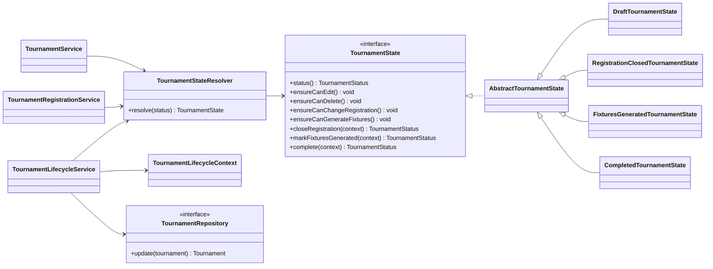
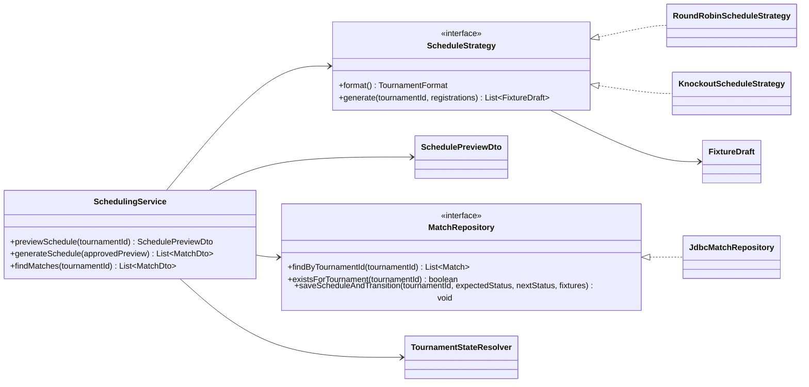

# Design Patterns

## State: tournament lifecycle

### Problem

Tournament operations depend on the current lifecycle stage. A Draft tournament can be edited and accept registrations, a Registration Closed tournament can generate fixtures, a Fixtures Generated tournament can finish only after every fixture is complete, and a Completed tournament must reject further lifecycle changes. Keeping these checks as repeated status conditions in services would make the rules easy to duplicate or contradict.

### Decision

`TournamentState` defines the lifecycle operations. `DraftTournamentState`, `RegistrationClosedTournamentState`, `FixturesGeneratedTournamentState`, and `CompletedTournamentState` implement the behavior for one status each. `TournamentStateResolver` maps the persisted `TournamentStatus` to the corresponding behavior.

`TournamentService` and `TournamentRegistrationService` ask the current state whether editing, deletion, or registration changes are permitted. `TournamentLifecycleService` gathers registered-team and fixture progress, asks the state for a validated next status, and calls `TournamentRepository.update` only after validation succeeds.

### Alternative considered

A direct alternative was to place `if` or `switch` checks for `TournamentStatus` in each application service. That would use fewer classes initially, but the same status rules would be repeated across editing, registration, scheduling, and completion workflows.

### Consequence

The lifecycle has several small classes, but each class has one clear reason to change. Application services continue to coordinate persistence while the state objects contain the status-specific decisions. The database still stores the simple `TournamentStatus` value, so a restart reconstructs the correct behavior through `TournamentStateResolver`.

### Future benefit

A future Suspended or Archived status can be introduced with a new `TournamentState` implementation and resolver registration. Existing concrete states and JavaFX controllers would not need additional scattered status conditions.

## Strategy: fixture generation

### Problem

Round-robin and knockout tournaments need different scheduling algorithms. Round robin creates every unique team pairing, including odd-team bye handling. Knockout creates a seeded bracket containing assigned first-round fixtures, empty future rounds, and winner-progression links. Putting both algorithms into one application service would create a growing format switch and mix unrelated rules.

### Decision

`ScheduleStrategy` defines schedule generation from ordered `TournamentRegistration` values. `RoundRobinScheduleStrategy` implements the circle method, while `KnockoutScheduleStrategy` builds four-team or eight-team brackets. Both return `FixtureDraft` values and perform no database operations.

`SchedulingService` registers each strategy by `TournamentFormat` and selects the matching implementation without knowing its algorithm. It creates a read-only `SchedulePreviewDto` first. When that preview is approved, the service regenerates it from current data, rejects stale previews or duplicate generation, asks the current `TournamentState` to validate fixture generation, and calls `MatchRepository.saveScheduleAndTransition`.

`JdbcMatchRepository` inserts matches, resolves logical fixture numbers into `next_match_id` links, and changes the tournament to Fixtures Generated in one transaction. A failed match insert, link, or status update rolls back the entire operation.

### Alternative considered

The alternative was a single scheduling method with a `switch` on `TournamentFormat`. It would initially use fewer classes, but the method would combine circle rotation, knockout seeding, future-round creation, and progression linking. Each added format would require modifying the same conditional method.

### Consequence

The scheduling algorithms are isolated and can be tested without SQLite. The application service handles preview and workflow coordination, while the repository handles only persistence and its transaction. The extra interface and two implementations are justified because there are already two algorithms that vary independently.

### Future benefit

A group-stage or double round-robin format can be added as another `ScheduleStrategy` and registered for its format. Existing algorithms, persistence code, and JavaFX controllers would not need to be rewritten.
